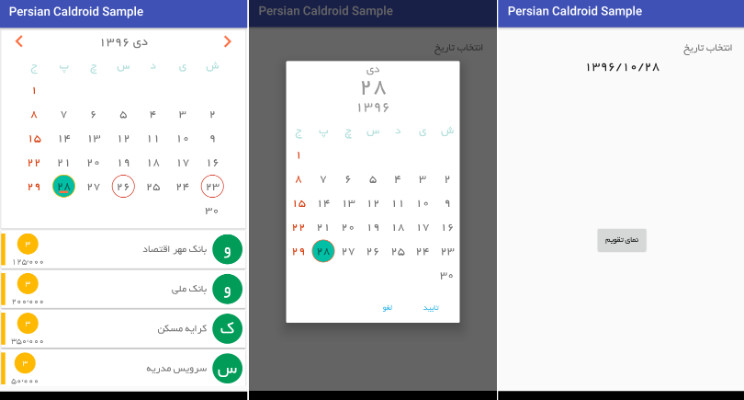

Persian Caldroid
=============================
<ul>
    <li><b>Persian DatePicker</b> 
                This api privides the users a nice and modern looking calendar to pick a date from.</li>
    <li><b>Persian CalendarView</b> 
                This api lets the users to have a full funtion CaledarView to mark their events on specific dates.</li>
</ul>

Screenshots
-----------------------------

Download Sample App
-----------------------------
<ul>
    <li> <a href="https://github.com/dariushm2/PersianCaldroid/releases/" >Github</a> </li>
</ul>

Apps that are using PersianCaldroid library
-----------------------------
<ul>
    <li> <a href="https://cafebazaar.ir/app/com.dariushm2.PaymentManager/?l=fa" >Payments Manger</a> </li>
</ul>

Adding this library to your project
-----------------------------
Gradle
--------------

        /* add this to build.gradle project level file */
        allprojects {
        		repositories {
        			...
        			maven { url 'https://jitpack.io' }
        		}
        }
        
        /* Add this to build.gradle app level file */
        implementation 'com.github.dariushm2:PersianCaldroid:1.0.1'
        
How to call DatePicker
--------------
   
        PersianCaldroidDialog persianCaldroidDialog = new PersianCaldroidDialog()
                .setOnDateSetListener(new PersianCaldroidDialog.OnDateSetListener() {
                    @Override
                    public void onDateSet(PersianCaldroidDialog dialog, PersianDate date) {
                        //do something when a date is picked
                        
                        dialog.dismiss();
                    }
                });
        //set font
        persianCaldroidDialog.setTypeface(ResourcesCompat.getFont(getContext(), R.font.font_family_yekan));
        //set a date to be selected and shown on calendar
        persianCaldroidDialog.setSelectedDate(new PersianDate(1396, 9, 24);
        persianCaldroidDialog.show(getActivity().getSupportFragmentManager(), PersianCaldroidDialog.class.getName());
    
How to add Persian CalendarView
--------------
    
        /* Java code */
        
        PersianCaldroidFragment persianCaldroidFragment = new PersianCaldroidFragment();
        // Set font
        persianCaldroidFragment.setTypeface(customFont);
        persianCaldroidFragment.setOnDateClickListener(new PersianCaldroidFragment.OnDateClickListener() {
            @Override
            public void onDateClick(PersianDate persianDate) {
            
                // Do something when a date is clicked
                
            }
        });
        persianCaldroidFragment.setOnChangeMonthListener(new PersianCaldroidFragment.OnChangeMonthListener() {
            @Override
            public void onChangeMonth() {
            
                // Do something when user switches to previous or next month
                
            }
        });
        /* Add dates with a specified colors, you want to be circled on calendar */
        HashMap<PersianDate, Integer> backgroundForDatesMap = new HashMap<>();
        backgroundForDatesMap.put(new PersianDate(), R.color.blue);
        persianCaldroidFragment.setBackgroundResourceForDates(backgroundForDatesMap);
        
        getSupportFragmentManager()
                .beginTransaction()
                .replace(
                        R.id.persianCaldroid,
                        persianCaldroidFragment,
                        PersianCaldroidFragment.class.getName()
                ).commit();
                
        ---xml layout---
        <android.support.v7.widget.CardView xmlns:android="http://schemas.android.com/apk/res/android"
            xmlns:app="http://schemas.android.com/apk/res-auto"
            android:id="@+id/cvCaldroid"
            android:layout_width="match_parent"
            android:layout_height="wrap_content"
            android:layout_marginLeft="3dp"
            android:layout_marginRight="3dp"
            android:layout_marginTop="3dp"
            android:foreground="?selectableItemBackground"
            android:layoutDirection="ltr"
            app:cardCornerRadius="1dp">
        
            <FrameLayout
                android:id="@+id/persianCaldroid"
                android:layout_width="match_parent"
                android:layout_height="wrap_content"
                android:orientation="vertical" />
        
        </android.support.v7.widget.CardView>
        
        
        /* For more complicated views such as showing list items below the calendar, please take a look at the sample app */
    
License
-----------------------------
Copyright (C) 2018  dariush.malek86@gmail.com

This program is free software: you can redistribute it and/or modify 
it under the terms of the GNU General Public License as published by 
the Free Software Foundation, either version 3 of the License, or 
(at your option) any later version.

This program is distributed in the hope that it will be useful, 
but WITHOUT ANY WARRANTY; without even the implied warranty of 
MERCHANTABILITY or FITNESS FOR A PARTICULAR PURPOSE.  See the 
GNU General Public License for more details.

You should have received a copy of the GNU General Public License 
along with this program.  If not, see http://www.gnu.org/licenses/.

Credits
-----------------------------
This library is developed by turning a calendar app to a library and adding extra features to it.
You can find this app at 
https://github.com/ebraminio/DroidPersianCalendar
